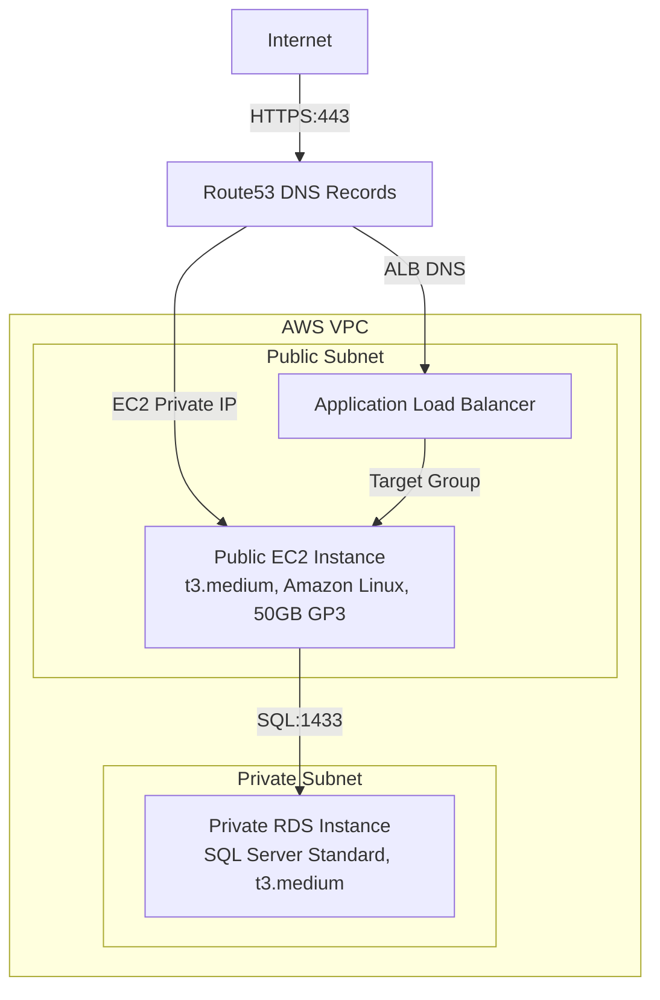

# EC2-RDS-ALB-Terraform-Deployment


A production-ready AWS infrastructure deployment using Terraform, featuring a public-facing EC2 instance, an Application Load Balancer (ALB), a private RDS SQL Server instance, a VPC, and Route53 DNS records for seamless access.

## 🚀 Overview

This project demonstrates a scalable and secure AWS infrastructure setup using **Terraform** as Infrastructure as Code (IaC). It provisions a **Virtual Private Cloud (VPC)** with public and private subnets, a **public-facing EC2 instance** for web hosting, an **Application Load Balancer (ALB)** for traffic distribution, a **private RDS SQL Server instance** for data storage, and **Route53 DNS records** for easy access. The architecture emphasizes security, scalability, and best practices for enterprise-grade deployments.

### Key Features
- **Scalable EC2 Deployment**: Public-facing t3.medium EC2 instance(s) running Amazon Linux with a 50GB GP3 EBS volume, configurable via Terraform `count` variable.
- **Load Balancing**: ALB with a target group to distribute traffic to EC2 instances.
- **Secure Database**: Private RDS instance running SQL Server Standard Edition, accessible only from the EC2 instance on port 1433.
- **Network Isolation**: VPC with public and private subnets for enhanced security.
- **DNS Management**: Route53 records for the EC2 private IP and ALB DNS name.
- **Production-Ready**: Follows AWS best practices for security, scalability, and maintainability.

## 🏗️ Architecture



## 📋 Prerequisites

Before deploying, ensure you have:
- **Terraform** (v1.5 or later) installed.
- **AWS CLI** configured with appropriate credentials and permissions.
- **AWS Account** with permissions for EC2, RDS, ALB, VPC, Route53, and IAM.
- **Route53 Hosted Zone** for DNS management (optional for custom domain).
- **SSH Key Pair** for EC2 access.

## 🚀 Quick Start

### 1. Clone the Repository
```bash
git clone https://github.com/soodrajesh/EC2-RDS-ALB-Terraform-Deployment.git
cd EC2-RDS-ALB-Terraform-Deployment
```

### 2. Configure Terraform Variables
Copy the example variables file and update it with your settings:
```bash
cp terraform.tfvars.example terraform.tfvars
```
Edit `terraform.tfvars` to include:
- `aws_region`: e.g., `eu-west-1`
- `ec2_instance_count`: Number of EC2 instances (default: 1)
- `route53_zone_id`: Your Route53 hosted zone ID (optional)
- `key_name`: Your EC2 SSH key pair name
- Other variables as needed (e.g., VPC CIDR, subnet configurations)

### 3. Deploy the Infrastructure
```bash
terraform init
terraform plan -var-file="terraform.tfvars"
terraform apply -var-file="terraform.tfvars"
```
Confirm with `yes` when prompted.

### 4. Access the Application
- **ALB URL**: Run `terraform output alb_dns_name` to get the ALB DNS.
- **EC2 DNS**: Run `terraform output ec2_dns_record` for the EC2 private IP DNS.
- Test the application: `curl https://<alb-dns-name>` or open in a browser.

## 📁 Project Structure
```
EC2-RDS-ALB-Terraform-Deployment/
├── main.tf               # Core Terraform configuration
├── variables.tf          # Input variables
├── outputs.tf            # Output values (e.g., ALB DNS, EC2 DNS)
├── terraform.tfvars.example  # Example variable file
├── README.md             # This file
└── .gitignore            # Git ignore rules
```

## 🔒 Security Best Practices
- **Least Privilege**: IAM roles restrict access to necessary resources only.
- **Network Isolation**: RDS is in a private subnet, accessible only from EC2.
- **Encrypted Storage**: EBS volume and RDS use AWS-managed encryption.
- **Secure DNS**: Route53 records ensure reliable and secure access.
- **Security Groups**: Restrict traffic to HTTPS (port 443) for EC2/ALB and SQL (port 1433) for RDS.

## 📊 Monitoring and Maintenance
- **CloudWatch**: Enable for EC2, RDS, and ALB metrics (e.g., CPU usage, request latency).
- **ALB Health Checks**: Configured to monitor EC2 instance health.
- **Scaling**: Adjust `ec2_instance_count` in `terraform.tfvars` to scale EC2 instances.
- **Backups**: Enable automated RDS backups via Terraform configuration.
- **Logs**: Check CloudWatch logs for EC2 and RDS troubleshooting.

## 🧹 Cleanup
To avoid costs, destroy the infrastructure when done:
```bash
terraform destroy -var-file="terraform.tfvars"
```
Confirm with `yes`.

## 🔍 Troubleshooting
- **EC2 Unreachable**: Verify security group rules allow port 443 and SSH (if needed).
- **RDS Connection Issues**: Ensure EC2 security group allows outbound traffic to RDS on port 1433.
- **ALB 502 Errors**: Check EC2 health checks and target group configuration.
- **Terraform Errors**: Run `terraform validate` and ensure `terraform.tfvars` is correct.
- **Debug Commands**:
  ```bash
  terraform show  # View current state
  aws ec2 describe-instances --instance-ids <instance-id>  # Check EC2 status
  aws rds describe-db-instances --db-instance-identifier <rds-id>  # Check RDS status
  ```

## 🤝 Contributing
1. Fork the repository.
2. Create a feature branch: `git checkout -b feature/your-feature`.
3. Commit changes: `git commit -m 'Add your feature'`.
4. Push to the branch: `git push origin feature/your-feature`.
5. Submit a pull request.

## 📄 License
This project is licensed under the MIT License - see the [LICENSE](LICENSE) file for details.

## 🆘 Support
For issues:
- Check the [troubleshooting section](#troubleshooting).
- Review AWS documentation for [EC2](https://docs.aws.amazon.com/ec2), [RDS](https://docs.aws.amazon.com/rds), [ALB](https://docs.aws.amazon.com/elasticloadbalancing), and [Terraform](https://www.terraform.io/docs).
- Open a GitHub issue for bugs or questions.

⭐ If this project helps you, please give it a star!

## 🙏 Acknowledgments
- AWS for robust cloud services.
- Terraform for streamlined IaC workflows.
- Built with ❤️ for the cloud engineering community.
